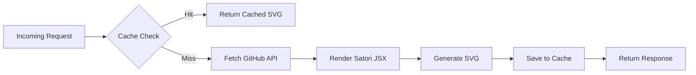

<div align="center">

```text
  ____ _ _   _   _       _     ____  _        _          _    ____ ___ 
 / ___(_) |_| | | |_   _| |__ / ___|| |_ __ _| |_ ___   / \  |  _ \_ _|
| |  _| | __| |_| | | | | '_ \\___ \| __/ _` | __/ __| / _ \ | |_) | | 
| |_| | | |_|  _  | |_| | |_) |___) | || (_| | |_\__ \/ ___ \|  __/| | 
 \____|_|\__|_| |_|\__,_|_.__/|____/ \__\__,_|\__|___/_/   \_\_|  |___|
```

<h1>📊 GitHub Stats API</h1>

**Dynamic GitHub stats cards — built with Hono + Satori, running on Cloudflare Workers free tier 24/7.**

<p>
  
  
  
  
  
  
</p>

[](https://deploy.workers.cloudflare.com/?url=https://github.com/ajit421/github_status)

<a href="https://ajit421.github.io/github_status/">
  
</a>

<br/><br/>

<table>
  <tr>
    <td align="center">
      <b>📊 GitHub Stats</b><br/>
      
    </td>
    <td align="center">
      <b>🌐 Top Languages</b><br/>
      
    </td>
  </tr>
  <tr>
    <td align="center">
      <b>🔥 Streak Stats</b><br/>
      
    </td>
    <td align="center">
      <b>📈 Commit Activity</b><br/>
      
    </td>
  </tr>
</table>

</div>

---

## ⚡ Enable the Builder in 60 Seconds

1. **Fork this repo** (or use your deployed copy)
2. Go to **Settings → Pages → Source:** `main` branch, `/docs` folder → **Save**
3. Wait ~60 seconds, then visit:
   ```
   https://YOUR_USERNAME.github.io/github_status/
   ```
4. **Done.** No external services, no accounts, no API keys needed in the builder itself.

---

## 📊 Cards Overview

| Card | Endpoint | Auth Required | Description |
| :--- | :--- | :---: | :--- |
| **📊 GitHub Stats** | `/api/stats` | Optional | Total stars, commits, PRs, issues, and rank |
| **🌐 Top Languages** | `/api/top-langs` | Optional | Most-used languages (normal, compact, or pie layout) |
| **🔥 Streak Stats** | `/api/streak` | **Yes** (GraphQL) | Current streak, longest streak, total contributions |
| **📈 Commit Activity** | `/api/commit-activity` | Optional | Commit history visualized by hour and day-of-week |

---

## 🎨 Card Builder Platform

<div align="center">

<table>
<tr><td>

> 🚀 **This repo includes a full interactive card builder.**
> No third-party websites. Hosted directly on GitHub Pages from this repository.
> Customize every parameter visually, see a live preview, and copy embed code instantly.

</td></tr>
</table>

</div>

### Setup Instructions — GitHub Pages

**Step 1.** Go to your repo → **Settings** → **Pages** (in the left sidebar)

**Step 2.** Under **Source**, select **Deploy from a branch**

**Step 3.** Set **Branch** to `main` and **Folder** to `/docs` → click **Save**

**Step 4.** Wait ~2 minutes for GitHub to deploy

**Step 5.** Visit **https://YOUR_USERNAME.github.io/github_status/** — your builder is live!

---

### 📌 Visual Parameter Reference

#### 1. GitHub Stats Card — `/api/stats`

| Category | Parameters |
| :--- | :--- |
| 📌 **Required** | <kbd>?username=</kbd> |
| 🎨 **Appearance** | <kbd>?theme=</kbd> &nbsp; <kbd>?hide_border=true</kbd> |
| 🔧 **Options** | <kbd>?custom_title=</kbd> &nbsp; <kbd>?hide_rank=true</kbd> &nbsp; <kbd>?show_icons=false</kbd> |
| 🎯 **Color Overrides** | <kbd>?bg_color=</kbd> &nbsp; <kbd>?text_color=</kbd> &nbsp; <kbd>?title_color=</kbd> &nbsp; <kbd>?icon_color=</kbd> &nbsp; <kbd>?border_color=</kbd> |

#### 2. Top Languages Card — `/api/top-langs`

| Category | Parameters |
| :--- | :--- |
| 📌 **Required** | <kbd>?username=</kbd> |
| 🎨 **Appearance** | <kbd>?theme=</kbd> &nbsp; <kbd>?hide_border=true</kbd> |
| 🔧 **Options** | <kbd>?layout=normal</kbd> &nbsp; <kbd>?layout=compact</kbd> &nbsp; <kbd>?layout=pie</kbd> |
| 🎯 **Color Overrides** | <kbd>?bg_color=</kbd> &nbsp; <kbd>?text_color=</kbd> &nbsp; <kbd>?title_color=</kbd> &nbsp; <kbd>?border_color=</kbd> |

#### 3. Streak Stats Card — `/api/streak`

| Category | Parameters |
| :--- | :--- |
| 📌 **Required** | <kbd>?username=</kbd> |
| 🎨 **Appearance** | <kbd>?theme=</kbd> &nbsp; <kbd>?hide_border=true</kbd> |
| 🎯 **Color Overrides** | <kbd>?bg_color=</kbd> &nbsp; <kbd>?text_color=</kbd> &nbsp; <kbd>?title_color=</kbd> &nbsp; <kbd>?border_color=</kbd> |
| ⚠️ **Note** | Requires `GITHUB_TOKEN` configured on server |

#### 4. Commit Activity Card — `/api/commit-activity`

| Category | Parameters |
| :--- | :--- |
| 📌 **Required** | <kbd>?username=</kbd> |
| 🎨 **Appearance** | <kbd>?theme=</kbd> &nbsp; <kbd>?hide_border=true</kbd> |
| 🎯 **Color Overrides** | <kbd>?bg_color=</kbd> &nbsp; <kbd>?text_color=</kbd> &nbsp; <kbd>?title_color=</kbd> &nbsp; <kbd>?border_color=</kbd> |

---

### 🎨 Themes Gallery

<table>
  <tr>
    <td align="center">
      <b>default</b><br/>
      
    </td>
    <td align="center">
      <b>dark</b><br/>
      
    </td>
    <td align="center">
      <b>tokyonight</b><br/>
      
    </td>
    <td align="center">
      <b>radical</b><br/>
      
    </td>
  </tr>
</table>

---

### 📋 Copy-Paste Ready Templates

> Replace `YOUR_USERNAME` with your GitHub username.

**📊 GitHub Stats**
```markdown

```

**🌐 Top Languages**
```markdown

```

**🔥 Streak Stats**
```markdown

```

**📈 Commit Activity**
```markdown

```

---

## 🚀 Quick Start

**1. Clone & install**
```bash
git clone https://github.com/ajit421/github_status.git
cd github_status
npm install
```

**2. Set your GitHub Token** *(needs `read:user` and `repo` scopes)*
```bash
npx wrangler secret put GITHUB_TOKEN
```

**3. Deploy to Cloudflare**
```bash
npm run deploy
```

---

## ⚙️ How It Works



### Caching TTLs

| Endpoint | TTL |
| :--- | :--- |
| `/api/stats` | 4 hours |
| `/api/top-langs` | 2 hours |
| `/api/streak` | 2 hours |
| `/api/commit-activity` | 2 hours |

---

## 🛠️ Local Development

```bash
npm run dev         # Start wrangler dev server at :8787
npm run deploy      # Bundle and deploy to Cloudflare
npm run type-check  # Run tsc --noEmit
```

### Project Structure

```text
github_status/
├── docs/
│   └── index.html       # Interactive card builder (GitHub Pages)
├── src/
│   ├── config/          # Constants, theme definitions
│   ├── routes/          # Hono route handlers
│   ├── services/        # GitHub API fetchers & logic
│   ├── templates/       # Satori JSX components
│   │   ├── cards/       # StatsCard, LanguageCard, StreakCard, ActivityCard
│   │   └── components/  # Icon, StatRow, RankCircle, DonutChart
│   ├── types/           # TypeScript definitions
│   ├── utils/           # Helpers, formatters, caching
│   └── index.ts         # Main worker entrypoint
├── wrangler.toml        # Cloudflare configuration
└── package.json
```

---

## 📄 License

[](https://opensource.org/licenses/MIT)

This project is licensed under the MIT License — see the `LICENSE` file for details.