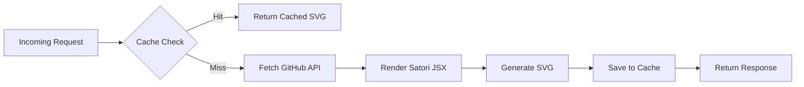

<div align="center">

```text
  ____ _ _   _   _       _     ____  _        _          _    ____ ___ 
 / ___(_) |_| | | |_   _| |__ / ___|| |_ __ _| |_ ___   / \  |  _ \_ _|
| |  _| | __| |_| | | | | '_ \\___ \| __/ _` | __/ __| / _ \ | |_) | | 
| |_| | | |_|  _  | |_| | |_) |___) | || (_| | |_\__ \/ ___ \|  __/| | 
 \____|_|\__|_| |_|\__,_|_.__/|____/ \__\__,_|\__|___/_/   \_\_|  |___|
```

<h1>📊 GitHub Stats API</h1>

**Dynamic GitHub stats cards — built with Hono + Satori, running on Cloudflare Workers free tier 24/7.**

<p>
  
  
  
  
  
  
</p>

[](https://deploy.workers.cloudflare.com/?url=https://github.com/ajit421/github_status)

[**✨ Open Live Card Builder ✨**](https://ajit421.github.io/github_status/card-builder.html)

<table>
  <tr>
    <td align="center">
      <b>GitHub Stats</b><br/>
      
    </td>
    <td align="center">
      <b>Top Languages</b><br/>
      
    </td>
  </tr>
  <tr>
    <td align="center">
      <b>Streak Stats</b><br/>
      
    </td>
    <td align="center">
      <b>Commit Activity</b><br/>
      
    </td>
  </tr>
</table>

</div>

---

## 📊 Cards Overview

| Card | Endpoint | Auth Required | Description |
| :--- | :--- | :--- | :--- |
| **GitHub Stats** | `/api/stats` | Optional | Displays total stars, commits, PRs, issues, and contributions. |
| **Top Languages** | `/api/top-langs` | Optional | Shows your most used languages in a normal, compact, or pie chart layout. |
| **Streak Stats** | `/api/streak` | **Yes** (GraphQL) | Highlights your current commit streak, longest streak, and total contributions. |
| **Commit Activity** | `/api/commit-activity` | Optional | Visualizes your commit history over the last year as an activity graph. |

---

## 🎨 Live Card Builder

> **💡 The Easiest Way to Create Your Cards!**
> 
> Stop guessing parameter names and hex codes. Use the interactive visual builder to customize your cards in real-time, then copy the markdown directly.

**MODE A — Use the Hosted Builder:**
Visit the live builder at: [https://ajit421.github.io/github_status/card-builder.html](https://ajit421.github.io/github_status/card-builder.html) (assuming hosted on gh-pages).

**MODE B — Self-Host:**
Simply copy the `card-builder.html` file to your repository's `gh-pages` branch or open it directly in your browser. No build steps required!

---

## 🚀 Quick Start

1. **Clone the repo**
   ```bash
   git clone https://github.com/ajit421/github_status.git && cd github_status && npm install
   ```
2. **Set your GitHub Token** (Needs `read:user` and `repo` scopes)
   ```bash
   npx wrangler secret put GITHUB_TOKEN
   ```
3. **Deploy to Cloudflare**
   ```bash
   npm run deploy
   ```

---

## 📖 Full Parameter Reference

<details>
<summary><b>1. GitHub Stats (<code>/api/stats</code>)</b></summary>

| Parameter | Type | Default | Description | Example Value |
| :--- | :--- | :--- | :--- | :--- |
| `username` | `string` | — | **Required.** GitHub username | `ajit421` |
| `theme` | `string` | `default` | Color theme for the card | `tokyonight` |
| `hide_rank` | `boolean` | `false` | Hide the rank circle badge | `true` |
| `show_icons` | `boolean` | `true` | Show icons next to stat names | `false` |
| `hide_border` | `boolean` | `false` | Hide the outer border of the card | `true` |
| `custom_title` | `string` | `[Name]'s GitHub Stats` | Override the card title text | `My Awesome Stats` |
| `bg_color` | `hex` | *theme default* | Background color override (no `#`) | `0d1117` |
| `text_color` | `hex` | *theme default* | Text color override (no `#`) | `e6edf3` |
| `title_color` | `hex` | *theme default* | Title color override (no `#`) | `58a6ff` |
| `icon_color` | `hex` | *theme default* | Icon color override (no `#`) | `3fb950` |
| `border_color` | `hex` | *theme default* | Border color override (no `#`) | `30363d` |

</details>

<details>
<summary><b>2. Top Languages (<code>/api/top-langs</code>)</b></summary>

| Parameter | Type | Default | Description | Example Value |
| :--- | :--- | :--- | :--- | :--- |
| `username` | `string` | — | **Required.** GitHub username | `ajit421` |
| `theme` | `string` | `default` | Color theme for the card | `tokyonight` |
| `layout` | `string` | `normal` | Layout style (`normal`, `compact`, `pie`) | `compact` |
| `hide_border` | `boolean` | `false` | Hide the outer border of the card | `true` |
| `bg_color` | `hex` | *theme default* | Background color override (no `#`) | `0d1117` |
| `text_color` | `hex` | *theme default* | Text color override (no `#`) | `e6edf3` |
| `title_color` | `hex` | *theme default* | Title color override (no `#`) | `58a6ff` |
| `border_color` | `hex` | *theme default* | Border color override (no `#`) | `30363d` |

</details>

<details>
<summary><b>3. Streak Stats (<code>/api/streak</code>)</b></summary>

| Parameter | Type | Default | Description | Example Value |
| :--- | :--- | :--- | :--- | :--- |
| `username` | `string` | — | **Required.** GitHub username | `ajit421` |
| `theme` | `string` | `default` | Color theme for the card | `radical` |
| `hide_border` | `boolean` | `false` | Hide the outer border of the card | `true` |
| `bg_color` | `hex` | *theme default* | Background color override (no `#`) | `0d1117` |
| `text_color` | `hex` | *theme default* | Text color override (no `#`) | `e6edf3` |
| `title_color` | `hex` | *theme default* | Title color override (no `#`) | `58a6ff` |
| `icon_color` | `hex` | *theme default* | Icon color override (no `#`) | `3fb950` |
| `border_color` | `hex` | *theme default* | Border color override (no `#`) | `30363d` |

</details>

<details>
<summary><b>4. Commit Activity (<code>/api/commit-activity</code>)</b></summary>

| Parameter | Type | Default | Description | Example Value |
| :--- | :--- | :--- | :--- | :--- |
| `username` | `string` | — | **Required.** GitHub username | `ajit421` |
| `theme` | `string` | `default` | Color theme for the card | `dark` |
| `hide_border` | `boolean` | `false` | Hide the outer border of the card | `true` |
| `bg_color` | `hex` | *theme default* | Background color override (no `#`) | `0d1117` |
| `text_color` | `hex` | *theme default* | Text color override (no `#`) | `e6edf3` |
| `title_color` | `hex` | *theme default* | Title color override (no `#`) | `58a6ff` |
| `border_color` | `hex` | *theme default* | Border color override (no `#`) | `30363d` |

</details>

---

## 🎨 Themes Gallery

<table>
  <tr>
    <td align="center">
      <b>default</b><br/>
      
    </td>
    <td align="center">
      <b>dark</b><br/>
      
    </td>
    <td align="center">
      <b>tokyonight</b><br/>
      
    </td>
    <td align="center">
      <b>radical</b><br/>
      
    </td>
  </tr>
</table>

---

## ⚙️ How It Works



### Caching TTLs

| Endpoint | TTL |
| :--- | :--- |
| `/api/stats` | 4 hours |
| `/api/top-langs` | 2 hours |
| `/api/streak` | 2 hours |
| `/api/commit-activity` | 2 hours |

---

## 🛠️ Local Development

```bash
npm run dev        # Start wrangler dev server at :8787
npm run deploy     # Bundle and deploy to Cloudflare
npm run type-check # Run tsc --noEmit
```

### Project Structure
```text
github_status/
├── src/
│   ├── config/          # Constants, theme definitions
│   ├── routes/          # Hono route handlers
│   ├── services/        # GitHub API fetchers & logic
│   ├── templates/       # Satori JSX components
│   ├── types/           # TypeScript definitions
│   ├── utils/           # Helpers, formatters, caching
│   └── index.ts         # Main worker entrypoint
├── wrangler.toml        # Cloudflare configuration
└── package.json
```

---

## 📄 License

[](https://opensource.org/licenses/MIT)

This project is licensed under the MIT License - see the LICENSE file for details.
